# Image Quilting for Texture Synthesis and Texture Transfer

This project implements the image quilting algorithm for texture synthesis and transfer, described in this SIGGRAPH 2001 [paper](https://www2.eecs.berkeley.edu/Research/Projects/CS/vision/papers/efros-siggraph01.pdf) by Efros and Freeman. Texture synthesis is the creation of a larger texture image from a small sample. Texture transfer is giving an object the appearance of having the same texture as a sample while preserving its basic shape. For texture synthesis, the main idea is to sample patches and lay them down in overlapping patterns, such that the overlapping regions are similar. Texture transfer is achieved by encouraging sampled patches to have similar appearance to a given target image, as well as matching overlapping regions of already sampled patches. The techniques utilized in this project are also useful for image stitching, image completion, image retargeting, and blending. This project is based on this [assignment](https://yxw.cs.illinois.edu/course/CS445/Content/projects/quilting/ComputationalPhotography_ProjectQuilting.html) in computational photography at UIUC in spring 2023.

## Table of Contents
1. [Texture Synthesis](#texture-synthesis)
1. [Quilt Cut Details](#quilt-cut-details)
1. [Texture Transfer Algorithm](#texture-transfer-algorithm)
1. [Face-in-Toast Image](#face-in-toast-image)
1. [Acknowledgments/Attributions](#acknowledgmentsattributions)

## Texture Synthesis

Texture synthesis is the creation of a larger texture image from a small sample. The below results experiment with three methdods. Quilt random texture randomly samples square patches from the sample and tiles them to create the output image. This method is the simplest and produces the worst results.

Quilt simple texture starts by sampling a random patch for the upper-left corner. Then subsequent sampled patches will overlap with part of the output image. The next selected patch minimized the sum of squared differences (SSD) of the overlapping regions of the existing and sampled patch. This method is a significant improvement over the previous method, however, it can produce noticeable seams since the overlapping regions may not match exactly.

Quilt cut texture incorporates the quilt cutting algorithm from [Efros and Freeman, 2001](https://www2.eecs.berkeley.edu/Research/Projects/CS/vision/papers/efros-siggraph01.pdf) that finds the minimal boundary cut in the overlapping region. This method produces more seamless blends between each sampled patch, and the overall result looks more natural. 

The full algorithm is as follows. For each overlapping patch in the output image:
1. Compute the SSD (sum of squared differences) of pixel values in the overlapping portion of the existing output and sample.
1. Select one sample patch that has a small cost (e.g. randomly pick one of K candidates)
1. Find a cut through the sampled patch and overlapping region with existing output. Use this cut to create a mask that specifies which pixels to copy from sample patch.
1. Copy masked pixels from sample image to corresponding pixel locations 
in output image.

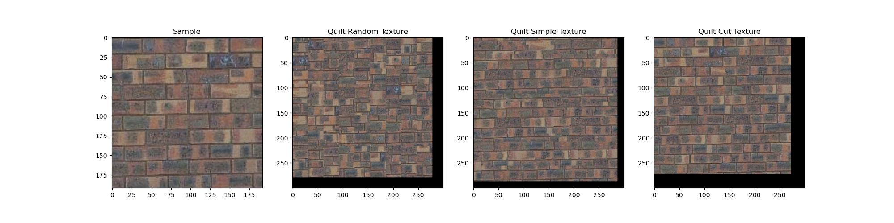

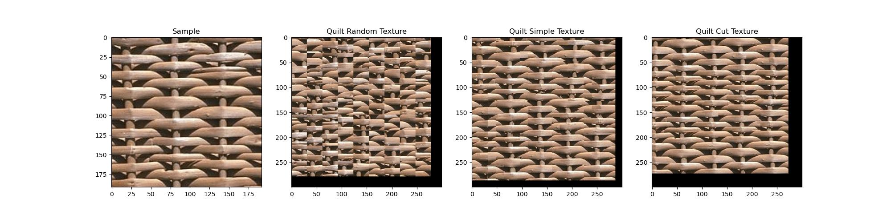

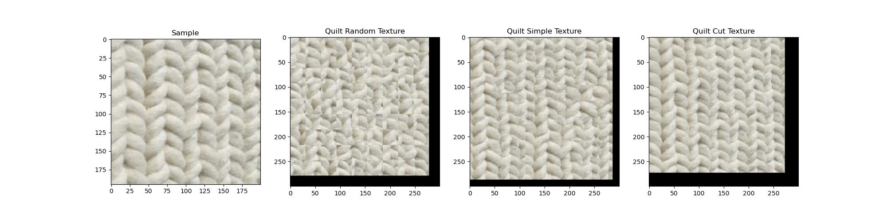

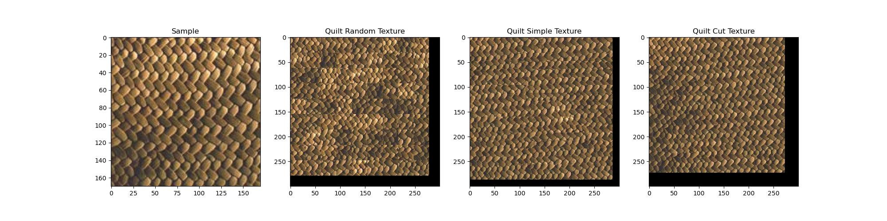

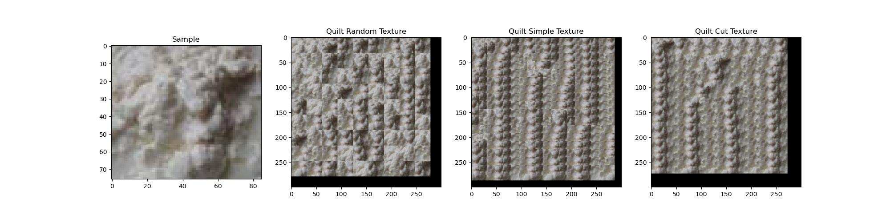

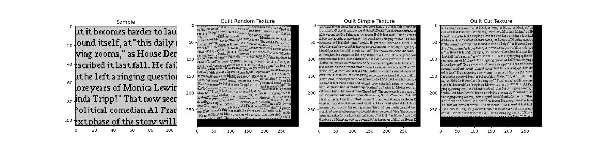

Parameters (all methods and results):
- Patch Size: 31
- Overlap Size: 15
- Output Size: 300
- Tolerance: 3

[Back to top](#table-of-contents)
 
 

## Quilt Cut Details

The below figure demonstrates how the quilt cut algorithm. The top-left image is the current output, the template is the part of the output to fill in, and the sampled patch is the patch that minimizes the SSD beteen overlapping region in the template. The second row shows the boundary cost for the overalapping region. Next, Dijkstra's algorithm is applied in the both the vertical and horizontal direction and then combined to find the minimal error boundary. Finally, in the bottom row, the quilt cut template are the pixels kept from the template (and in the current output), the quilt cut patch are the pixels kept from the sampled patch, and the new patch is the combination of the quilt cut template and patch. 

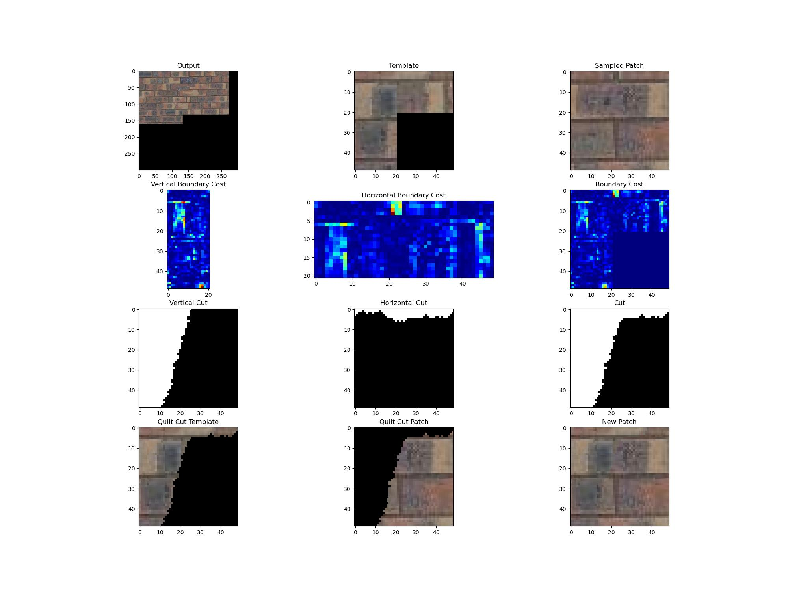

[Back to top](#table-of-contents)
 
 

## Texture Transfer Algorithm
The texture transfer method extends the texture synthesis algorithm by requiring that a selected patch satisfies a desired correspondence map. In this case, the correspondence map is the luminance (L in L*a\*b color space) between the texture and the target image. This correspondence adds a second, independent constraint to the SSD cost calculation. When done correctly, it will look like the target image is painted over by the texture.

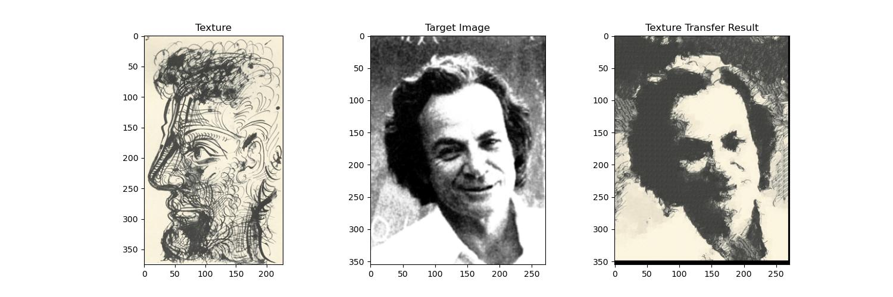

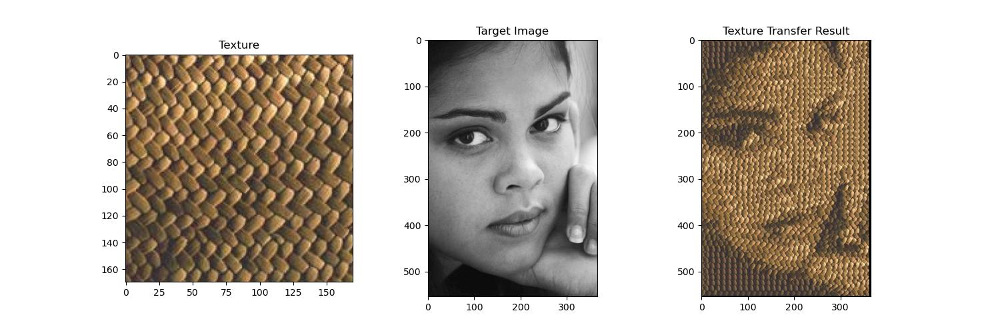

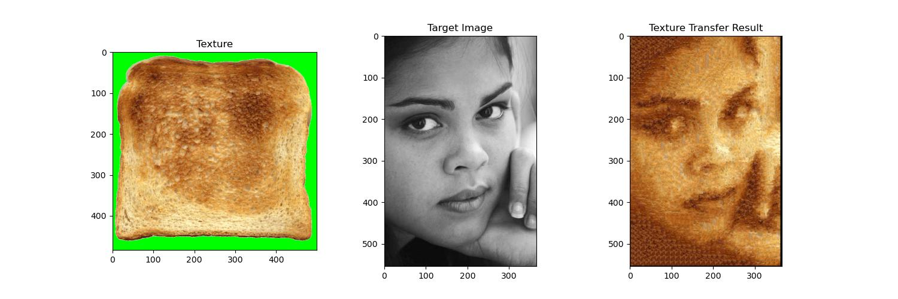

I modified the white background in the image of toast to green, so that the background would be selected during texture transfer.

[Back to top](#table-of-contents)
 
 

## Face-in-Toast Image
I resized the image of the girl, so that it would fit on the image of the toast. Then I performed the texture transfer algorithm to map the toast texture to the girl. Then I used alpha composting with feathering to blend the image of the girl and toast together. Alpha composting creates a mask that selects which pixel from each image to use. The values in the mask slowly increase from 0 to 1 in the regions where the two images overlap to better blend the images together. Feathering applies a Gaussian blur to the mask for further blending.

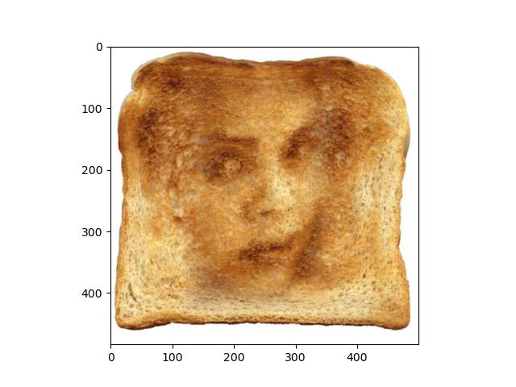

[Back to top](#table-of-contents)
 
 

## Acknowledgments/Attributions
- [Basket pattern](http://graphics.cs.cmu.edu/people/efros/research/quilting/results.html)
- [Weave pattern](http://graphics.cs.cmu.edu/people/efros/research/quilting/results3.html)
- [Girl](http://graphics.cs.cmu.edu/people/efros/research/quilting/results3.html)
- [Coffee beans](https://dissolve.com/stock-photo/Pile-brown-roasted-coffee-royalty-free-image/101-D145-195-260)
- [Stone pavers](https://www.swtexture.com/2017/08/stone-pavers-paving-stones.html)

[Back to top](#table-of-contents)